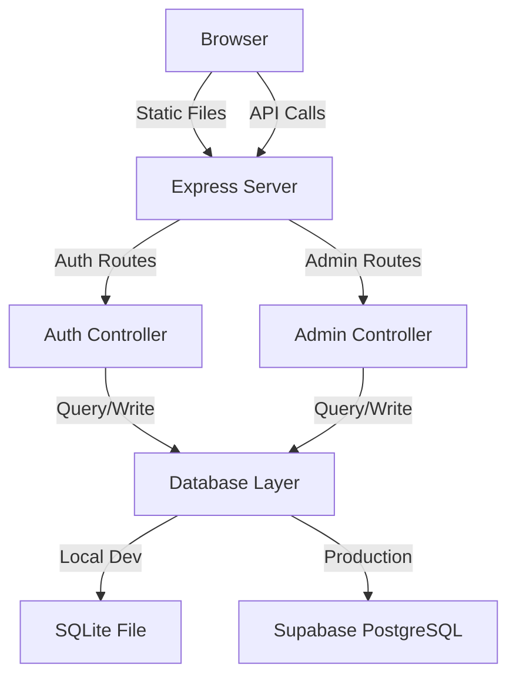

# Authentication, User Approval & Super Admin Panel

## Background & Current State

The project is currently a **pure frontend application** (HTML + CSS + vanilla JS + Bootstrap 5.3.3) with:
- No backend framework — only a PowerShell static file server (`start_server.ps1`) on port 8080
- No `package.json`, no Node.js, no npm
- All data stored in `localStorage`
- No database

Adding authentication requires **introducing a Node.js/Express backend** with a real database, while keeping all existing frontend functionality unchanged.

---

## User Review Required

> [!IMPORTANT]
> **Major Architectural Addition**: This introduces a Node.js + Express backend to the project. The existing PowerShell server (`start_server.ps1`) and `run_locally.bat` will be replaced by an Express-based dev server that serves both the API and static files.

> [!IMPORTANT]
> **Database Choice for Local Development**: I'll use **SQLite** (via `better-sqlite3`) for local development. It's zero-config, file-based, and requires no external database installation. For production, it switches to **Supabase PostgreSQL** via environment variable.

> [!WARNING]
> **Super Admin Credentials**: The default `.env` will contain `SUPERADMIN_USERNAME=superadmin` and `SUPERADMIN_PASSWORD=admin123`. These **must** be changed before any production deployment.

---

## Open Questions

> [!IMPORTANT]
> **Protected Routes**: Should the existing admission dashboard require login to access? Or should authentication only gate certain admin features? My default approach: **All existing pages require login** (authenticated users with APPROVED status can access them). The login/register pages and `/superuser` are the only public routes.

> [!IMPORTANT]
> **Session Duration**: How long should JWT tokens be valid? Default plan: **24 hours** with no refresh token (simple approach). Can be extended later.

---

## Proposed Changes

### Architecture Overview



**Key Principle**: The database layer uses an adapter pattern — a single interface with two implementations (SQLite / PostgreSQL). Switching is controlled entirely by the `DATABASE_URL` environment variable.

---

### Component 1: Backend Foundation

#### [NEW] [package.json](file:///c:/Users/Admin/OneDrive/Documents/KVS%20Admission%20Management%20System/package.json)
- Node.js project manifest
- Dependencies: `express`, `bcryptjs`, `jsonwebtoken`, `better-sqlite3`, `pg`, `dotenv`, `cors`, `helmet`, `cookie-parser`, `express-rate-limit`
- Scripts: `dev` (nodemon), `start` (node)

#### [NEW] [.env](file:///c:/Users/Admin/OneDrive/Documents/KVS%20Admission%20Management%20System/.env)
```
NODE_ENV=development
PORT=8080
DATABASE_URL=sqlite:./data/app.db
JWT_SECRET=dev-secret-change-in-production-abc123
SUPERADMIN_USERNAME=superadmin
SUPERADMIN_PASSWORD=admin123
```

#### [NEW] [.env.example](file:///c:/Users/Admin/OneDrive/Documents/KVS%20Admission%20Management%20System/.env.example)
- Same as `.env` but with placeholder values for documentation

#### [NEW] [.gitignore](file:///c:/Users/Admin/OneDrive/Documents/KVS%20Admission%20Management%20System/.gitignore)
- Ignore `node_modules/`, `.env`, `data/*.db`

#### [NEW] [server.js](file:///c:/Users/Admin/OneDrive/Documents/KVS%20Admission%20Management%20System/server.js)
- Express application entry point
- Loads environment variables via `dotenv`
- Configures middleware: `helmet`, `cors`, `cookie-parser`, `express-rate-limit`, JSON body parser
- Mounts API routes under `/api/auth/*` and `/api/admin/*`
- Serves static files from `/public` directory (where existing frontend files will live)
- Serves `login.html` as the default page, `index.html` only for authenticated users
- Database initialization on startup

---

### Component 2: Database Layer

#### [NEW] [src/db/index.js](file:///c:/Users/Admin/OneDrive/Documents/KVS%20Admission%20Management%20System/src/db/index.js)
- Database adapter factory — reads `DATABASE_URL` to determine which adapter to use
- Exports a unified interface: `getDb()` returning the active adapter

#### [NEW] [src/db/sqlite-adapter.js](file:///c:/Users/Admin/OneDrive/Documents/KVS%20Admission%20Management%20System/src/db/sqlite-adapter.js)
- SQLite implementation using `better-sqlite3`
- Creates `data/app.db` file automatically
- Implements all database operations (CRUD for users)

#### [NEW] [src/db/pg-adapter.js](file:///c:/Users/Admin/OneDrive/Documents/KVS%20Admission%20Management%20System/src/db/pg-adapter.js)
- PostgreSQL implementation using `pg` (for Supabase)
- Same interface as SQLite adapter
- Connection pooling via `pg.Pool`

#### [NEW] [src/db/schema.js](file:///c:/Users/Admin/OneDrive/Documents/KVS%20Admission%20Management%20System/src/db/schema.js)
- Shared schema definitions and migration logic
- Creates the `users` table:

```sql
CREATE TABLE IF NOT EXISTS users (
  id            INTEGER PRIMARY KEY AUTOINCREMENT,  -- SERIAL for PG
  full_name     TEXT NOT NULL,
  username      TEXT NOT NULL UNIQUE,
  email         TEXT NOT NULL UNIQUE,
  mobile        TEXT NOT NULL,
  password_hash TEXT NOT NULL,
  role          TEXT NOT NULL DEFAULT 'USER',
  status        TEXT NOT NULL DEFAULT 'PENDING',
  approved      INTEGER NOT NULL DEFAULT 0,         -- BOOLEAN for PG
  created_at    TEXT DEFAULT CURRENT_TIMESTAMP,      -- TIMESTAMPTZ for PG
  updated_at    TEXT DEFAULT CURRENT_TIMESTAMP,
  approved_at   TEXT,
  approved_by   TEXT
);

CREATE UNIQUE INDEX IF NOT EXISTS idx_users_username ON users(username);
CREATE UNIQUE INDEX IF NOT EXISTS idx_users_email ON users(email);
CREATE INDEX IF NOT EXISTS idx_users_status ON users(status);
```

---

### Component 3: Authentication API

#### [NEW] [src/routes/auth.js](file:///c:/Users/Admin/OneDrive/Documents/KVS%20Admission%20Management%20System/src/routes/auth.js)
Express router with endpoints:

| Method | Path | Description |
|--------|------|-------------|
| `POST` | `/api/auth/register` | Register new user (validates, hashes password, saves with PENDING status) |
| `POST` | `/api/auth/login` | Login (validates credentials, checks approved status, returns JWT in httpOnly cookie) |
| `POST` | `/api/auth/logout` | Clears auth cookie |
| `GET`  | `/api/auth/me` | Returns current user info from JWT |

**Registration validation**:
- All fields required
- Username: 3-30 chars, alphanumeric + underscores only, unique
- Email: valid format, unique
- Mobile: 10+ digits
- Password: min 8 chars, at least 1 uppercase, 1 lowercase, 1 digit
- Confirm password must match

**Login logic**:
1. Find user by username or email
2. Verify password with `bcryptjs.compare()`
3. Check `status === 'APPROVED'` and `approved === true`
4. If PENDING → "Your account is awaiting approval from the Super Administrator"
5. If REJECTED → "Your registration has been rejected"
6. If DISABLED → "Your account has been disabled"
7. If approved → issue JWT in `httpOnly` cookie, return user data

#### [NEW] [src/routes/admin.js](file:///c:/Users/Admin/OneDrive/Documents/KVS%20Admission%20Management%20System/src/routes/admin.js)
Express router for Super Admin operations:

| Method | Path | Description |
|--------|------|-------------|
| `POST` | `/api/admin/login` | Super Admin login (validates against env vars, returns JWT with SUPERADMIN role) |
| `GET`  | `/api/admin/users` | Get all users grouped by status |
| `POST` | `/api/admin/users/:id/approve` | Approve a user |
| `POST` | `/api/admin/users/:id/reject` | Reject a user |
| `POST` | `/api/admin/users/:id/disable` | Disable a user |
| `DELETE` | `/api/admin/users/:id` | Delete a user |

---

### Component 4: Middleware

#### [NEW] [src/middleware/auth.js](file:///c:/Users/Admin/OneDrive/Documents/KVS%20Admission%20Management%20System/src/middleware/auth.js)
- `requireAuth`: Extracts JWT from cookie, verifies, attaches `req.user`
- `requireRole(roles)`: Checks if `req.user.role` is in allowed roles
- `requireSuperAdmin`: Shorthand for `requireRole(['SUPERADMIN'])`

---

### Component 5: Frontend — New Pages

#### [NEW] [public/login.html](file:///c:/Users/Admin/OneDrive/Documents/KVS%20Admission%20Management%20System/public/login.html)
- Premium login page matching the existing Samagam design system
- Username/email field, password field, login button
- "Forgot Password" placeholder link
- Link to Register page
- Client-side validation before API call
- Displays server error messages (pending/rejected/disabled states)
- On success → redirect to `/dashboard`

#### [NEW] [public/register.html](file:///c:/Users/Admin/OneDrive/Documents/KVS%20Admission%20Management%20System/public/register.html)
- Premium registration page matching design system
- Fields: Full Name, Username, Email, Mobile, Password, Confirm Password
- Real-time validation with visual feedback
- On success → show "Registration submitted. Awaiting approval" message
- Link back to Login page

#### [NEW] [public/superuser.html](file:///c:/Users/Admin/OneDrive/Documents/KVS%20Admission%20Management%20System/public/superuser.html)
- Hidden Super Admin portal (not in navigation)
- Contains login form (username + password)
- After login, renders the admin dashboard with 3 tabbed sections:
  1. **Pending Users** — table with Approve/Reject/Delete actions
  2. **Approved Users** — table with Disable/Delete actions  
  3. **Rejected Users** — table with Approve/Delete actions
- Live-updating tables via API polling
- Action confirmations via the existing Samagam popup dialog

#### [NEW] [public/auth.css](file:///c:/Users/Admin/OneDrive/Documents/KVS%20Admission%20Management%20System/public/auth.css)
- Styles for login, register, and super admin pages
- Matches existing design system (colors, fonts, card styles)
- Premium glassmorphism login card with gradient background
- Responsive design

#### [NEW] [public/auth.js](file:///c:/Users/Admin/OneDrive/Documents/KVS%20Admission%20Management%20System/public/auth.js)
- Client-side auth utilities
- `checkAuth()`: Verifies JWT on page load, redirects to login if invalid
- `logout()`: Calls logout API, clears state, redirects
- Form validation helpers
- API call wrappers with error handling

---

### Component 6: Existing Frontend Migration

#### [MODIFY] Move existing frontend files to `public/` directory

The existing frontend files need to be served from the `public/` directory:

| Current Location | New Location |
|-----------------|--------------|
| `index.html` | `public/index.html` |
| `styles.css` | `public/styles.css` |
| `app.js` | `public/app.js` |
| `SAMPLES/` | `public/SAMPLES/` |

#### [MODIFY] [public/index.html](file:///c:/Users/Admin/OneDrive/Documents/KVS%20Admission%20Management%20System/public/index.html)
- Add `<script src="auth.js"></script>` before `app.js`
- Add auth check on page load (redirect to login if not authenticated)
- Add logout button in the navigation bar (rightmost position)
- Add a small user indicator showing the logged-in username

#### [MODIFY] [public/app.js](file:///c:/Users/Admin/OneDrive/Documents/KVS%20Admission%20Management%20System/public/app.js)
- Wrap `initApp()` with auth check — only initialize if authenticated
- Add `logout()` function

---

### Component 7: Dev Tooling Updates

#### [MODIFY] [run_locally.bat](file:///c:/Users/Admin/OneDrive/Documents/KVS%20Admission%20Management%20System/run_locally.bat)
- Update to use `npm run dev` instead of the PowerShell server
- Keep the kill-existing-process logic

#### [DELETE] ~~start_server.ps1~~ → Keep but mark as legacy
- The PowerShell server is replaced by Express, but we won't delete it to avoid breaking anything if someone needs it

---

## File Structure (Final)

```
KVS Admission Management System/
├── .env                          # Environment variables (git-ignored)
├── .env.example                  # Template for environment variables
├── .gitignore                    # Git ignore rules
├── package.json                  # Node.js project manifest
├── server.js                     # Express server entry point
├── run_locally.bat               # Updated launcher
├── start_server.ps1              # Legacy (kept for reference)
├── data/                         # SQLite database directory
│   └── app.db                    # Auto-created SQLite database
├── src/
│   ├── db/
│   │   ├── index.js              # Database adapter factory
│   │   ├── schema.js             # Table definitions & migrations
│   │   ├── sqlite-adapter.js     # SQLite implementation
│   │   └── pg-adapter.js         # PostgreSQL implementation
│   ├── middleware/
│   │   └── auth.js               # JWT auth & role middleware
│   └── routes/
│       ├── auth.js               # /api/auth/* endpoints
│       └── admin.js              # /api/admin/* endpoints
└── public/                       # Static frontend files
    ├── index.html                # Main app (existing, modified)
    ├── styles.css                # Existing styles (moved)
    ├── app.js                    # Existing app logic (moved)
    ├── login.html                # New login page
    ├── register.html             # New registration page
    ├── superuser.html            # New super admin portal
    ├── auth.css                  # Auth pages styles
    ├── auth.js                   # Auth client utilities
    └── SAMPLES/                  # Existing sample files (moved)
```

---

## Verification Plan

### Automated Tests

1. **Server startup**: `npm run dev` — verify Express starts on port 8080
2. **Database creation**: Verify `data/app.db` is auto-created with correct schema
3. **Registration flow**: Register a new user via the browser, verify PENDING status
4. **Login blocked**: Attempt login with PENDING user, verify rejection message
5. **Super Admin login**: Navigate to `/superuser`, login with env credentials
6. **Approve user**: Approve the registered user via super admin panel
7. **Login success**: Login with approved user, verify redirect to dashboard
8. **Dashboard access**: Verify all existing dashboard features work unchanged
9. **Logout**: Verify logout clears session and redirects to login
10. **Reject/Disable flows**: Test reject and disable actions in admin panel

### Manual Verification
- Visual inspection of login/register/superuser pages for design consistency
- Test all existing features (import, verification, lottery slips, etc.) to confirm no regressions
